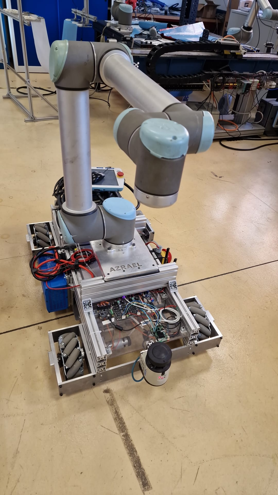

Collection of ROS2 packages for the Azrael mobile manipulator developed in STIIMA-CNR

RPI4  : ubuntu@192.168.1.10(raspberry)  
NUC   : pauli@192.168.1.128(pauli)  

On the RPI4 run the motor driver in azrael_base_driver/build/ as "sudo azrael_mobile_driver"  
On the Nuc run "ros2 launch azrael_driver_udp azrael_driver_bringup.py" to bringup the driver,odometry,lidar,and robot description.  
The "azrael_base_nav.launch.py" provides a basic navigation environment.  

