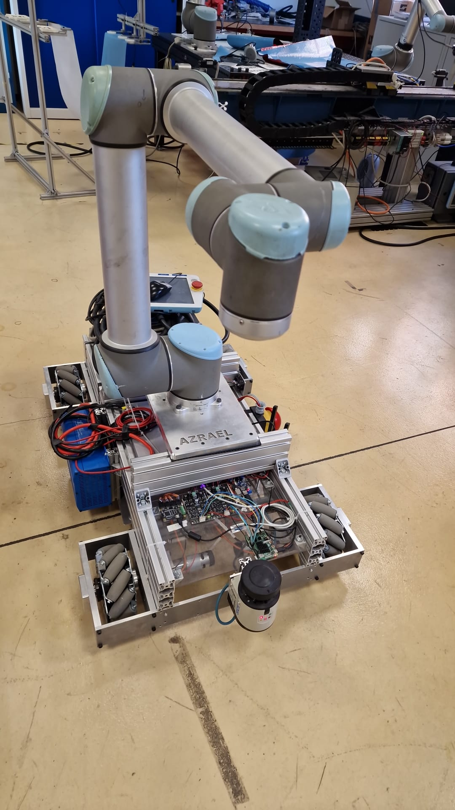

# Azrael mobile manipulator

Collection of ROS 2 packages for the Azrael mobile manipulator, developed at STIIMA-CNR.

[](https://www.stiima.cnr.it/)

---

## Packages

| Package | Description |
|---|---|
| [`azrael`](azrael) | Metapackage bundling the packages below |
| [`azrael_app`](azrael_app) | Launch files, configs, and RViz setups to bring up the robot |
| [`azrael_description`](azrael_description) | URDF, meshes, and configuration describing the robot |
| [`azrael_driver_udp`](azrael_driver_udp) | ROS 2 driver to move Azrael via the RPI4 base driver over UDP |
| [`azrael_moveit_config`](azrael_moveit_config) | MoveIt configuration for the UR manipulator |

## Requirements

- ROS 2 Humble
- Dependencies listed in [`dependencies.repos`](dependencies.repos) (fetch with `vcs import < dependencies.repos`)

## Network Setup

| Host | Address |
|---|---|
| RPI4 (base) | `ubuntu@192.168.1.10` |
| NUC (onboard PC) | `pauli@192.168.1.128` |

## Quick Start

### 1. Base motor control (Raspberry Pi 4)

```bash
ssh ubuntu@192.168.1.10
sudo azrael_base_driver/build/azrael_mobile_driver
```
This starts the low-level base motor driver.

### 2. Core bringup (NUC)

```bash
ssh pauli@192.168.1.128
```

#### 2.1 Base driver, odometry, lidar

```bash
ros2 launch azrael_app base_bringup.launch.yml
```

#### 2.2 UR manipulator + gripper bringup

```bash
ros2 launch azrael_app ur_bringup.launch.py
```

Example:
```bash
ros2 launch azrael_app ur_bringup.launch.py fake_ur:=false gripper:=robotiq-2f-140
```

Available grippers:
- `robotiq-2f-140`
- `robotiq-2f-85`

### 3. Navigation & localization (remote PC)

```bash
ros2 launch azrael_app nav.launch.yml
```
This starts the navigation stack (map server, planner, controller, AMCL, etc.).

### 4. Visualization (remote RViz)

```bash
ros2 launch azrael_app remote_rviz.launch.py
```

## Manual Teleoperation

### Joystick
```bash
ros2 launch azrael_app joy.launch.yml
```

### Keyboard
```bash
ros2 run teleop_twist_keyboard teleop_twist_keyboard \
  --ros-args -r /cmd_vel:=/azrael/cmd_vel
```
